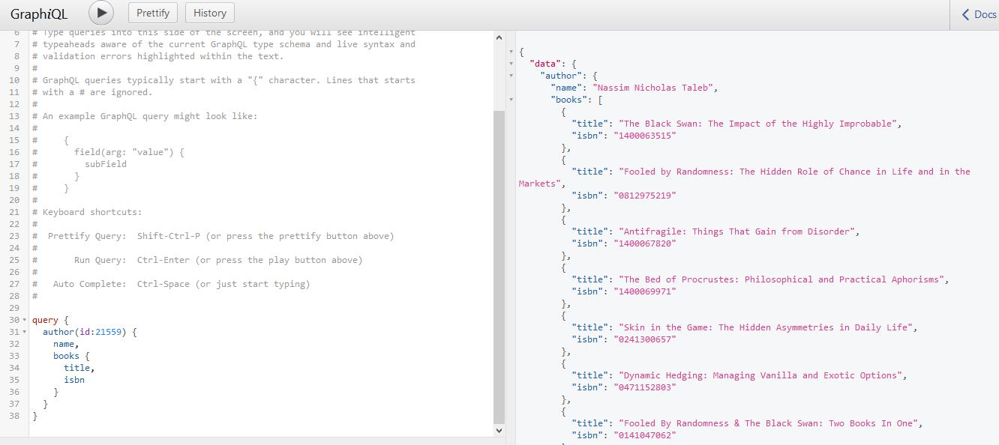

# graphql-goodreads
[GraphQL]("https://graphql.org") top layer for [Goodreads API]("https://www.goodreads.com/api")
  

  

  

  
Main tools:  
* nodejs with express
* xml2js - convert xml to js object (goodreads api returns xml response) 
* express-graphql module
  
Edit `schema.js` to accept more data from the Goodreads API.  
  
Navigate to `localhost:3000/graphql` to access the `graphiql` interface similar to the one below:  

